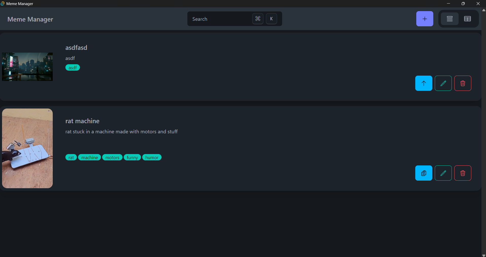
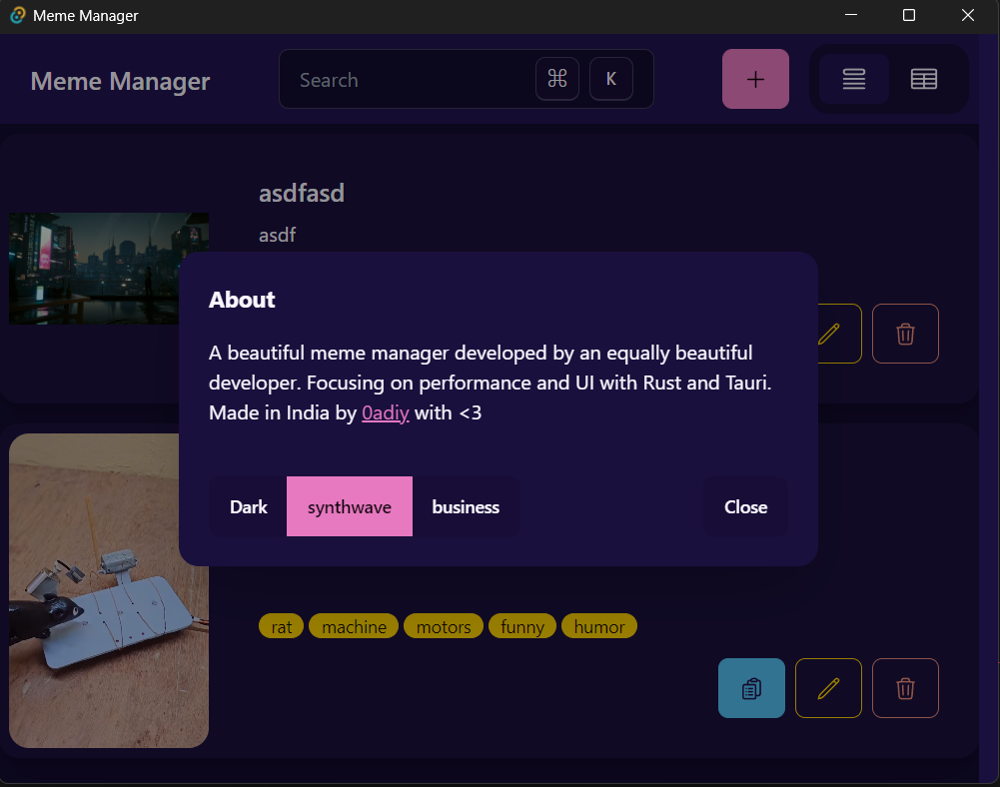
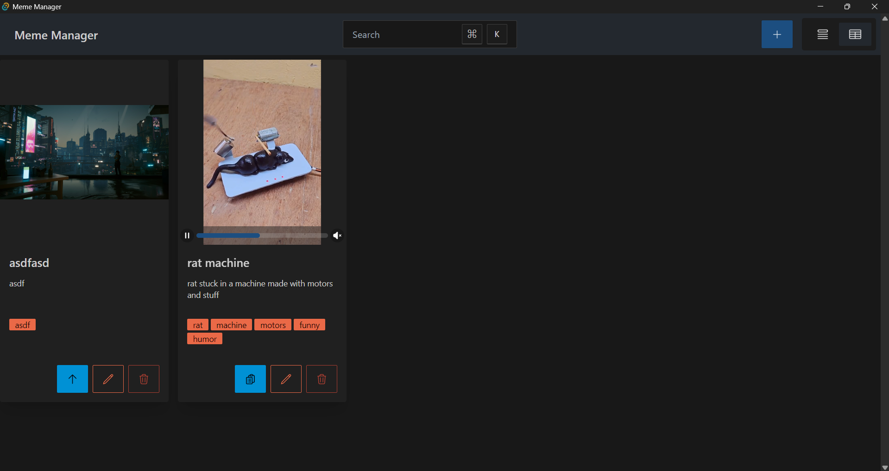
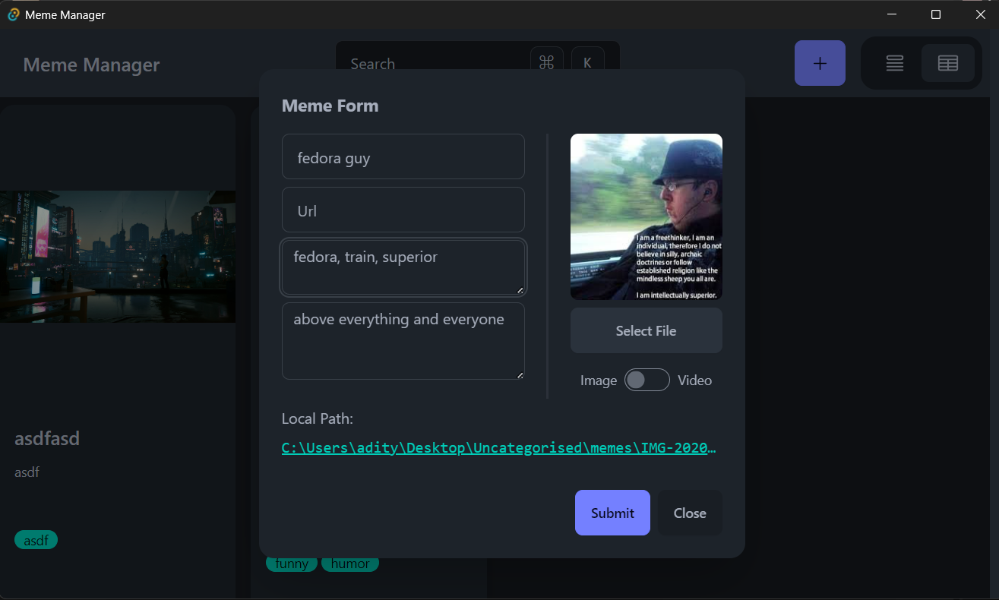

# Meme Manager

Meme Manager is a sleek and powerful tool for managing your favorite memes. With its native experience and intuitive UI, you can easily browse, tag, sort, and share your memes. Say goodbye to endless scrolling on social media and hello to a more organized and enjoyable meme-browsing experience.

## Snapshots






## Features

- 🌈 **Multiple Themes**: With the help of daisyUI, customize the look and feel of Meme Manager to match your preferences. 🎨
- 📋 **Grid View and List View**: Switch between two intuitive views to suit your browsing needs. 📈
- 📁 **Local Memes**: Store your memes locally for offline access and easy organization. 📂
- 🌐 **Online Memes**: Browse the latest memes directly from the internet. 🌐
- 🔍 **Filters**: Filter your memes by tags, descriptions, and more. 🔍
- 🔗 **Tags**: Tag your memes for easy categorization and search. 🔗
- 🔍 **Search and Sort**: Search and sort your memes for easier organization. 🔍
- 🔗 **Quick Share**: Share your memes with others with just a click. 📨
## Installation

- [Download](https://github.com/tauri-apps/meme-manager/releases)

## Development Workflow
### Pre-requisites
- [Rust](https://www.rust-lang.org/tools/install) - the language used for backend
- [Tauri prerequisites](https://tauri.app/v1/guides/getting-started/prerequisites) - framework using rust and js
- [Nodejs](https://nodejs.org/en/) - a server-side javascript runtime
- [Yarn](https://yarnpkg.com/lang/en/docs/install/) - for package management

### To run in development mode
1. clone the repo
```bash
git clone https://github.com/tauri-apps/meme-manager.git
cd meme-manager
```
2. install dependencies
```bash
yarn
```
3. run in dev mode
```bash
yarn tauri dev
```

## Recommended IDE Setup
- [VS Code](https://code.visualstudio.com/) + [Tauri](https://marketplace.visualstudio.com/items?itemName=tauri-apps.tauri-vscode) + [rust-analyzer](https://marketplace.visualstudio.com/items?itemName=rust-lang.rust-analyzer)
